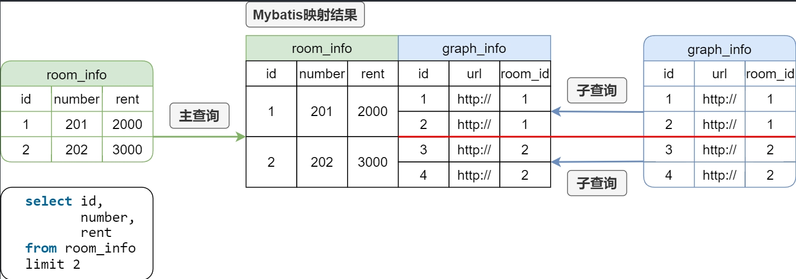

## Maven依赖引入

### 1.单项目

```xml
<dependencies>
 <dependency>
     <groupId></groupId>
        <artifactId></artifactId>
        <version></version>
    </dependency>
    ...
</dependencies>
```

- **groupId**：组织或公司名称，通常是反向域名。例如，`org.springframework.boot`
- **artifactId**：项目名称或模块名称。例如，`spring-boot-starter-web`
- **version**：依赖项的版本号。例如，`2.5.4`

### 2. 多模块项目

`<dependencyManagement>` 标签用于集中管理依赖版本。它允许你在父 POM 文件中定义依赖的版本，然后在子模块中引用这些依赖，而无需在每个子模块中重复指定版本。

#### 父POM文件

```xml
<project xmlns="http://maven.apache.org/POM/4.0.0"
         xmlns:xsi="http://www.w3.org/2001/XMLSchema-instance"
         xsi:schemaLocation="http://maven.apache.org/POM/4.0.0 http://maven.apache.org/xsd/maven-4.0.0.xsd">
    <modelVersion>4.0.0</modelVersion>

    <groupId>com.example</groupId>
    <artifactId>parent-project</artifactId>
    <version>1.0-SNAPSHOT</version>
    <packaging>pom</packaging>

    <dependencyManagement>
        <dependencies>
            <dependency>
                <groupId>org.springframework.boot</groupId>
                <artifactId>spring-boot-starter-web</artifactId>
                <version>2.5.4</version>
            </dependency>
            <dependency>
                <groupId>org.springframework.boot</groupId>
                <artifactId>spring-boot-starter-data-jpa</artifactId>
                <version>2.5.4</version>
            </dependency>
        </dependencies>
    </dependencyManagement>

    <modules>
        <module>module-a</module>
        <module>module-b</module>
    </modules>
</project>
```

#### 子POM文件

```xml
<project xmlns="http://maven.apache.org/POM/4.0.0"
         xmlns:xsi="http://www.w3.org/2001/XMLSchema-instance"
         xsi:schemaLocation="http://maven.apache.org/POM/4.0.0 http://maven.apache.org/xsd/maven-4.0.0.xsd">
    <modelVersion>4.0.0</modelVersion>

    <parent>
        <groupId>com.example</groupId>
        <artifactId>parent-project</artifactId>
        <version>1.0-SNAPSHOT</version>
    </parent>

    <artifactId>module-a</artifactId>

    <dependencies>
        <dependency>
            <groupId>org.springframework.boot</groupId>
            <artifactId>spring-boot-starter-web</artifactId>
        </dependency>
    </dependencies>
</project>
```

------

在 `pom.xml` 文件中，可以添加 `<properties>` 标签来定义依赖的版本号：

```xml
<project xmlns="http://maven.apache.org/POM/4.0.0"
         xmlns:xsi="http://www.w3.org/2001/XMLSchema-instance"
         xsi:schemaLocation="http://maven.apache.org/POM/4.0.0 http://maven.apache.org/xsd/maven-4.0.0.xsd">
    <modelVersion>4.0.0</modelVersion>

    <groupId>com.example</groupId>
    <artifactId>my-app</artifactId>
    <version>1.0-SNAPSHOT</version>

    <properties>
        <spring.boot.version>2.5.4</spring.boot.version>
        <mysql.connector.version>8.0.26</mysql.connector.version>
    </properties>

    <dependencies>
        <dependency>
            <groupId>org.springframework.boot</groupId>
            <artifactId>spring-boot-starter-web</artifactId>
            <version>${spring.boot.version}</version>
        </dependency>
        <dependency>
            <groupId>org.springframework.boot</groupId>
            <artifactId>spring-boot-starter-data-jpa</artifactId>
            <version>${spring.boot.version}</version>
        </dependency>
        <dependency>
            <groupId>mysql</groupId>
            <artifactId>mysql-connector-java</artifactId>
            <version>${mysql.connector.version}</version>
        </dependency>
    </dependencies>
</project>
```

使用 `<properties>` 标签来集中管理依赖的版本号。这种方法可以使版本号在整个项目中保持一致，并且更容易维护。

> 在子模块没有引入相应依赖的时候，父POM不会将依赖注入到项目中。（不用担心父POM中的error）

## Knife4j配置

> knife4j官方文档：<https://doc.xiaominfo.com/docs/quick-start>

### 1. 依赖引入

```xml
<!--knife4j文档-->
<!--官方文档：https://doc.xiaominfo.com/docs/quick-start -->
<dependency>
    <groupId>com.github.xiaoymin</groupId>
    <artifactId>knife4j-openapi3-jakarta-spring-boot-starter</artifactId>
    <version>${knife4j.version}</version>
</dependency>
```

### 2. 配置类

#### 2.1 在不使用 `@EnableSwagger2WebMvc` 的情况下配置 Knife4j

```java
@Configuration
public class Knife4jConfiguration {

    @Bean
    public OpenAPI customOpenAPI() {
        return new OpenAPI()
                .info(new Info()
                        .title("API 文档")
                        .version("1.0")
                        .description("接口描述")
                        .termsOfService("http://doc.xiaominfo.com")
                        .license(new License()
                                .name("Apache 2.0")
                                .url("http://doc.xiaominfo.com")));
    }
    
    // 将接口分组
    @Bean
    public GroupedOpenApi systemAPI() {
        return GroupedOpenApi.builder()
            .group("系统信息管理")
            .pathsToMatch(
                    "/admin/system/**"
            )
            .build();
    }
}
```

#### 2.2 使用 `@EnableSwagger2WebMvc` 的情况下配置 Knife4j

> To Do...

```java
@Configuration
@EnableSwagger2WebMvc
public class Knife4jConfiguration {

    @Bean(value = "defaultApi2")
    public Docket defaultApi2() {
        return new Docket(DocumentationType.SWAGGER_2)
                .apiInfo(apiInfo())
                .groupName("2.X版本")
                .select()
                .apis(RequestHandlerSelectors.basePackage("com.github.xiaoymin.knife4j.controller"))
                .paths(PathSelectors.any())
                .build();
    }

    private ApiInfo apiInfo() {
        return new ApiInfoBuilder()
                .title("API 文档")
                .description("# swagger-bootstrap-ui-demo RESTful APIs")
                .termsOfServiceUrl("http://www.xx.com/")
                .contact("xx@qq.com")
                .version("1.0")
                .build();
    }
}
```

### 3. 创建控制器

```java
@Tag(name = "首页模块")
@RestController
public class IndexController {

    @Operation(summary = "向客人问好")
    @GetMapping("/sayHi")
    public ResponseEntity<String> sayHi(@RequestParam(value = "name") String name) {
        return ResponseEntity.ok("Hi: " + name);
    }
}
```

### 4. 启动项目

启动 Spring Boot 项目，并在浏览器中访问 `http://localhost:8080/doc.html` 查看生成的 API 文档。

### 5. 相关配置

- SpringDoc OpenAPI 的一个配置选项，用于控制参数对象的展平方式。具体来说，这个配置项决定了在生成 OpenAPI 文档时，是否将参数对象展平为单个参数，而不是嵌套对象。

```yaml
springdoc:
    default-flat-param-object: true
```

## MyBatis

### 1. `<resultMap>`元素

`<resultMap>` 元素用于定义结果映射。它包含多个 `<result>`、`<id>` 和 `<association>` 等子元素，用于指定如何将查询结果映射到 Java 对象的属性上。

### 2. 示例代码

`User.java`

```java
public class User {
    private int id;
    private String name;
    private String email;

    // Getters and Setters
}
```

`UserMapper.xml`

```xml
<?xml version="1.0" encoding="UTF-8" ?>
<!DOCTYPE mapper
  PUBLIC "-//mybatis.org//DTD Mapper 3.0//EN"
  "http://mybatis.org/dtd/mybatis-3-mapper.dtd">

<mapper namespace="com.example.mapper.UserMapper">

    <!-- 定义 resultMap -->
    <resultMap id="userResultMap" type="com.example.model.User">
        <id property="id" column="id" />
        <result property="name" column="name" />
        <result property="email" column="email" />
    </resultMap>

    <!-- 使用 resultMap 的查询语句 -->
    <select id="selectAllUsers" resultMap="userResultMap">
        SELECT * FROM users
    </select>

</mapper>
```

> 可以使用`<resultMap id="?" type="?" autoMapping="true">`会将`resultMapping`中的字段按照名称相同的方式映射到返回类型的对应属性上，在映射时会自动忽略大小写。
>
> Mybatis的自动映射策略默认是开启的，而且默认是只对**非嵌套**的resultMap进行自动映射。

- **`<resultMap>`**：定义结果映射，`id` 是结果映射的唯一标识符，`type` 是映射的 Java 对象类型。
- **`<id>`**：指定主键属性的映射，`property` 是 Java 对象的属性名，`column` 是数据库表的列名。
- **`<result>`**：指定普通属性的映射，`property` 是 Java 对象的属性名，`column` 是数据库表的列名。
- **`<select>`**：使用 `<resultMap>` 的查询语句，`resultMap` 属性指定使用的结果映射。

### 3. 复杂映射

如果查询结果包含嵌套对象，可以使用 `<association>` 和 `<collection>` 元素进行复杂映射。

`Order.java`

```java
public class Order {
    private int id;
    private User user;
    private String orderNumber;

    // Getters and Setters
}
```

`OrderMapper.xml`

```xml
<mapper namespace="com.example.mapper.OrderMapper">

    <!-- 定义嵌套 resultMap -->
    <resultMap id="orderResultMap" type="com.example.model.Order">
        <id property="id" column="id" />
        <result property="orderNumber" column="order_number" />
        <association property="user" javaType="com.example.model.User" resultMap="com.example.mapper.UserMapper.userResultMap" />
    </resultMap>

    <!-- 使用嵌套 resultMap 的查询语句 -->
    <select id="selectAllOrders" resultMap="orderResultMap">
        SELECT o.id, o.order_number, u.id AS user_id, u.name, u.email
        FROM orders o
        JOIN users u ON o.user_id = u.id
    </select>

</mapper>
```

- **`<association>`**：用于映射嵌套对象，`property` 是 Java 对象的属性名，`javaType` 是嵌套对象的类型，`resultMap` 是嵌套对象的结果映射。
- **`<collection>`**： MyBatis 中用于定义一对多关系映射的元素，它允许将查询结果中的多个记录映射到一个 Java 对象的集合属性上。例如Java中List类型的对象。

### 知识点

- **xml文件的`<`和`>`的转义**

  | 原符号 | 转义符号 |
  | ---- | ---- |
  | `<` | `&lt;` |
  | `>` | `&gt;` |

- **Mybatis-Plus分页插件注意事项**

  使用Mybatis-Plus的分页插件进行分页查询时，如果结果需要使用`<collection>`进行映射，只能使用 **[嵌套查询（Nested Select for Collection)](https://mybatis.org/mybatis-3/sqlmap-xml.html#nested-select-for-collection)**，而不能使用 **[嵌套结果映射（Nested Results for Collection）](https://mybatis.org/mybatis-3/sqlmap-xml.html#nested-results-for-collection)**。

  **嵌套查询**和**嵌套结果映射**是Collection映射的两种方式，下面通过一个案例进行介绍

  例如有`room_info`和`graph_info`两张表，其关系为一对多，如下
  

  现需要查询房间列表及其图片信息，期望返回的结果如下

  ```json
  [
      {
          "id": 1,
          "number": 201,
          "rent": 2000,
          "graphList": [
              {
                  "id": 1,
                  "url": "http://",
                  "roomId": 1
              },
              {
                  "id": 2,
                  "url": "http://",
                  "roomId": 1
              }
          ]
      },
      {
          "id": 2,
          "number": 202,
          "rent": 3000,
          "graphList": [
              {
                  "id": 3,
                  "url": "http://",
                  "roomId": 2
              },
              {
                  "id": 4,
                  "url": "http://",
                  "roomId": 2
              }
          ]
      }
  ]
  ```

  为得到上述结果，可使用以下两种方式

  - **嵌套结果映射**

    ```xml
    <select id="selectRoomPage" resultMap="RoomPageMap">
        select ri.id room_id,
               ri.number,
               ri.rent,
            gi.id graph_id,
               gi.url,
               gi.room_id
        from room_info ri
        left join graph_info gi on ri.id=gi.room_id
    </select>
    
    <resultMap id="RoomPageMap" type="RoomInfoVo" autoMapping="true">
        <id column="room_id" property="id"/>
        <collection property="graphInfoList" ofType="GraphInfo" autoMapping="true">
            <id column="graph_id" property="id"/>
        </collection>
    </resultMap>
    ```

    这种方式的执行原理如下图所示:

    

  - **嵌套查询**

    ```xml
    <select id="selectRoomPage" resultMap="RoomPageMap">
        select id,
               number,
               rent
        from room_info
    </select>
    
    <resultMap id="RoomPageMap" type="RoomInfoVo" autoMapping="true">
        <id column="id" property="id"/>
        <collection property="graphInfoList" ofType="GraphInfo" select="selectGraphByRoomId"       column="id"/>
    </resultMap>
    
    <select id="selectGraphByRoomId" resultType="GraphInfo">
        select id,
               url,
            room_id
        from graph_info
        where room_id = #{id}
    </select>
    ```

    这种方法使用两个独立的查询语句来获取一对多关系的数据。首先，Mybatis会执行主查询来获取`room_info`列表，然后对于每个`room_info`，Mybatis都会执行一次子查询来获取其对应的`graph_info`。

    

  若现在使用MybatisPlus的分页插件进行分页查询，假如查询的内容是第**1**页，每页**2**条记录，则上述两种方式的查询结果分别是

  - **嵌套结果映射**

    

  - **嵌套查询**

    

  显然**嵌套结果映射**的分页逻辑是存在问题的。
  
  ## Redis缓存优化

### 1. 概述

缓存优化是一个性价比很高的优化手段，多数情况下，缓存优化可以通过一些简单的操作，换来性能的大幅提升。缓存优化的核心思想就是将一些原本保存在磁盘（例如MySQL）中的、经常访问并且查询开销比较大的数据，临时保存到内存（例如Redis）中。后序再访问相同数据时，就可直接从内存中获取结果，而无需再访问磁盘，由于内存的读写速度远高于磁盘，因此就能极大的提高程序的性能。


在使用缓存优化时，有一个问题不得不提，那就是**数据库和缓存数据的一致性**，当数据库中的数据发生变化时，缓存中的数据也要同步更新，否则就会出现数据不一致的问题，解决该问题的方案有如下几个

- 数据发生变化时，更新数据库的同时也更新缓存
- 数据发生变化时，更新数据库的同时删除缓存

进行缓存优化时，查询涉及多表访问，需要多次访问数据库的接口，查询代价较高，可以采取缓存优化，加快查询速度。

### 2. 自定义`RedisTemplate`

本项目使用Reids保存缓存数据，因此我们需要使用RedisTemplate进行读写操作。前文提到过，`Spring-data-redis`提供了`StringRedisTemplate`和`RedisTemplate<Object,Object>`两个实例，但是两个实例均不满足我们当前的需求，所以我们需要自定义RedisTemplate。

```java
@Configuration
public class RedisConfiguration {

    @Bean
    public RedisTemplate<String, Object> stringObjectRedisTemplate(RedisConnectionFactory redisConnectionFactory) {
        RedisTemplate<String, Object> template = new RedisTemplate<>();
        template.setConnectionFactory(redisConnectionFactory);
        template.setKeySerializer(RedisSerializer.string());
        template.setValueSerializer(RedisSerializer.java());
        return template;
    }
}
```

### 3. 压力测试

使用Postman或者Apifox等工具对接口进行压力测试。
